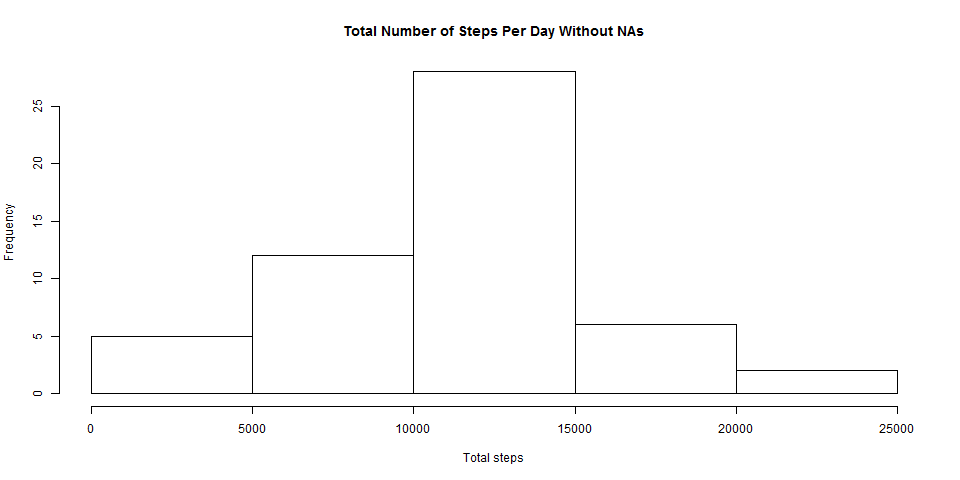
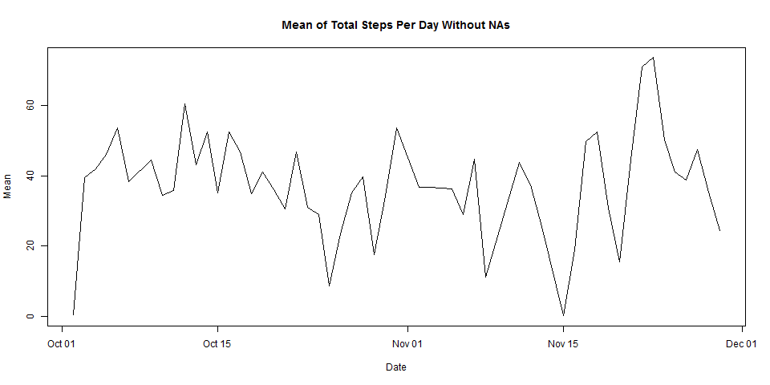
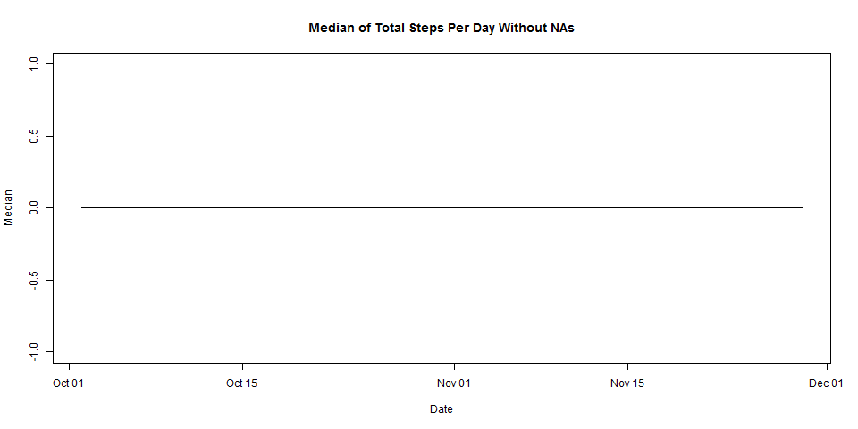
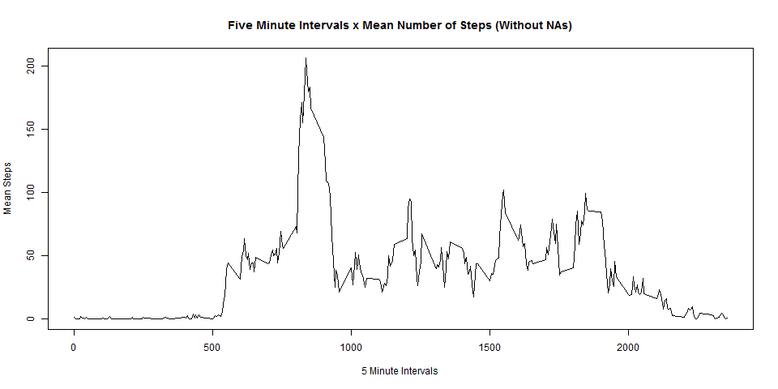
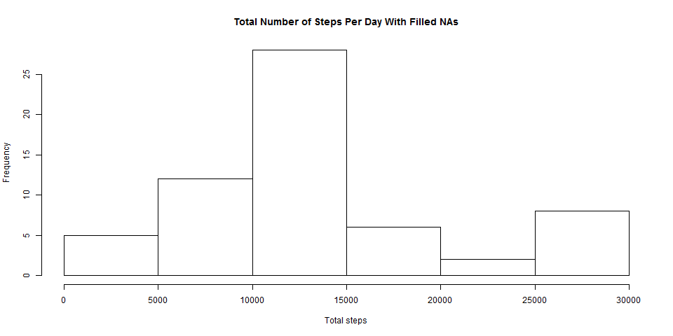
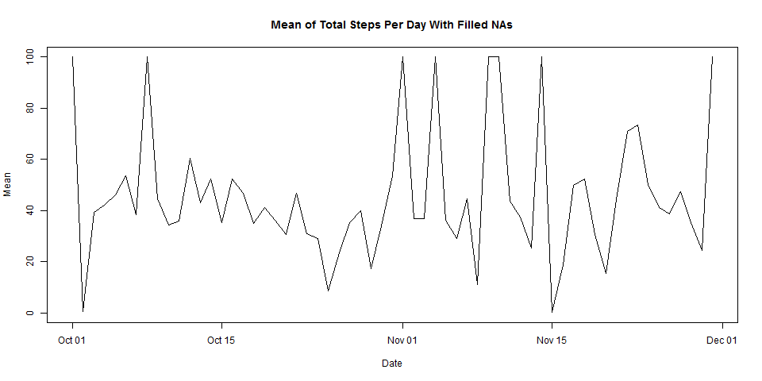
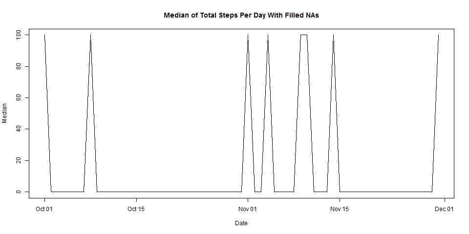
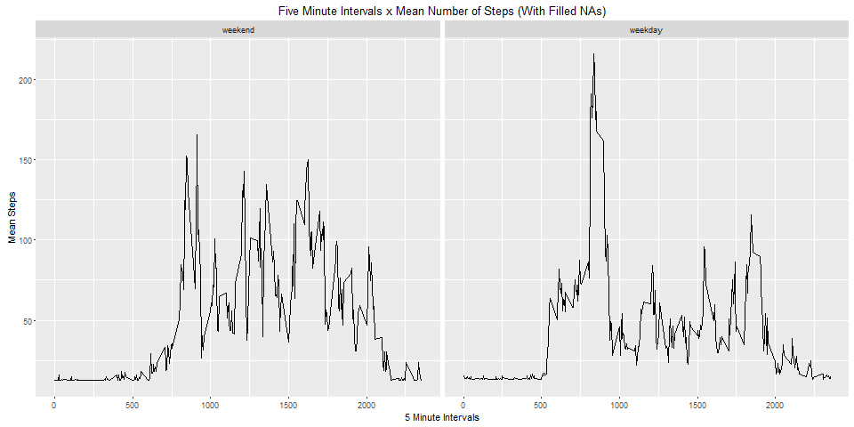

## Reproducible Research Project 01

###Introduction
It is now possible to collect a large amount of data about personal movement using activity monitoring devices such as a Fitbit, Nike Fuelband, or Jawbone Up. These type of devices are part of the “quantified self” movement – a group of enthusiasts who take measurements about themselves regularly to improve their health, to find patterns in their behavior, or because they are tech geeks. But these data remain under-utilized both because the raw data are hard to obtain and there is a lack of statistical methods and software for processing and interpreting the data.

###Assignment
This assignment makes use of data from a personal activity monitoring device. This device collects data at 5 minute intervals through out the day. The data consists of two months of data from an anonymous individual collected during the months of October and November, 2012 and include the number of steps taken in 5 minute intervals each day.

More specifically, this report answers questions aimed at discovering walking patterns of an individual.

###1. Loading and preprocessing the data
**Data URL:** https://d396qusza40orc.cloudfront.net/repdata%2Fdata%2Factivity.zip

**Download date and time:** 2016-02-07 13:30

**Data filename:** activity.csv

**Number of rows:** 17568

**Variables:**

* **steps**: Number of steps taking in a 5-minute interval (missing values are coded as NA)

* **date**: The date on which the measurement was taken in YYYY-MM-DD format

* **interval**: Identifier for the 5-minute interval in which measurement was taken

**Steps:**

1.1. Load the data.

1.2. Process/transform the data (if necessary) into a format suitable for your analysis.

**R Code:**
```r
# Import libraries
library(data.table)
library(ggplot2)

# #####################################
# 1. Loading and preprocessing the data
# #####################################

# ### 1.1. Load in the data and transform its column types, in order to make those columns suitable for analysis ###
# Set the download URL, the data directory name, and the downloaded zip file name
dataDownloadURL <- "https://d396qusza40orc.cloudfront.net/repdata%2Fdata%2Factivity.zip"
dataDir         <- paste0(getwd(), "/repres/prj01/data")
downloadZipName <- paste0(dataDir, "/dataactivity.zip")

# Make sure the data directory exists
if (!file.exists(dataDir))
  dir.create(dataDir)

# Download and unzip the data files. Overwrite exisiting file, if any
download.file(dataDownloadURL, destfile=downloadZipName)
unzip(zipfile=downloadZipName, exdir=dataDir)

# Read in the data file and transform the column types
dataFname    <- paste0(dataDir, "/activity.csv")
activityData <- read.table(dataFname, header = TRUE, sep = ",", colClasses = c("numeric", "Date", "numeric"))
```

###2. What is mean total number of steps taken per day?
**Steps:**

2.1. Calculate the total number of steps taken per day.

2.2. Make a histogram of the total number of steps taken each day.

2.3. Calculate and report the mean and median of the total number of steps taken per day.

**R Code:**
```r
# ###########################################
# 2. Mean total number of steps taken per day
# ###########################################

# ### NOTE: For this part of the assignment, you can ignore the missing values in the dataset ###
naRows <- is.na(activityData$steps)
activityDataWithoutNAs <- activityData[!naRows,]

# ### 2.1. Calculate the total number of steps taken per day ###
totalStepsPerDay <- data.table(activityDataWithoutNAs[, c(1, 2)])
totalStepsPerDay[, steps.per.day:=sum(steps), by = date]
totalStepsPerDay <- unique(totalStepsPerDay[,list(date, steps.per.day)])

# ### 2.2. Make a histogram of the total number of steps taken each day ###
png(filename = paste0(dataDir, "plot1.png"), width=960, height=480, units='px')
hist(totalStepsPerDay$steps.per.day, xlab = "Total steps", main = "Total Number of Steps Per Day Without NAs")
dev.off()

# ### 2.3. Calculate and report the mean and median of the total number of steps taken per day ###
meanTotalStepsPerDay <- data.table(activityDataWithoutNAs[, c(1, 2)])
meanTotalStepsPerDay[, mean.steps.per.day:=mean(steps), by = date]
meanTotalStepsPerDay <- unique(meanTotalStepsPerDay[,list(date, mean.steps.per.day)])

medianTotalStepsPerDay <- data.table(activityDataWithoutNAs[, c(1, 2)])
medianTotalStepsPerDay[, median.steps.per.day:=median(steps), by = date]
medianTotalStepsPerDay <- unique(medianTotalStepsPerDay[,list(date, median.steps.per.day)])

png(filename = paste0(dataDir, "plot2.png"), width=960, height=480, units='px')
plot(meanTotalStepsPerDay$date, meanTotalStepsPerDay$mean.steps.per.day, type = "l", xlab = "Date", ylab = "Mean", main = "Mean of Total Steps Per Day Without NAs")
dev.off()

png(filename = paste0(dataDir, "plot3.png"), width=960, height=480, units='px')
plot(medianTotalStepsPerDay$date, medianTotalStepsPerDay$median.steps.per.day, type = "l", xlab = "Date", ylab = "Median", main = "Median of Total Steps Per Day Without NAs")
dev.off()
```

**Figures:**

 

 

 


###3. What is the average daily activity pattern?
**Steps:**

3.1. Make a time series plot (i.e. type = "l") of the 5-minute interval (x-axis) and the average number of steps taken, averaged across all days (y-axis).

3.2. Which 5-minute interval, on average across all the days in the dataset, contains the maximum number of steps?

**R Code:**
```r
# ########################
# 3. Average daily pattern
# ########################

# ### 3.1. Make a time series plot (i.e. type = "l") of the 5-minute interval (x-axis) and the average number of steps 
# taken, averaged across all days (y-axis) ###
meanPer5MinInterval <- data.table(activityDataWithoutNAs[, c(1, 2, 3)])
meanPer5MinInterval[, mean.steps.per.5min:=mean(steps), by = interval]
meanPer5MinInterval <- unique(meanPer5MinInterval[,list(interval, mean.steps.per.5min)])

png(filename = paste0(dataDir, "plot4.png"), width=960, height=480, units='px')
plot(meanPer5MinInterval$interval, meanPer5MinInterval$mean.steps.per.5min, type = "l", xlab = "5 Minute Intervals", ylab = "Mean Steps", main = "Five Minute Intervals x Mean Number of Steps (Without NAs)")
dev.off()

# ### 3.2. Which 5-minute interval, on average across all the days in the dataset, contains the maximum number of steps? ###
meanPer5MinInterval[order(meanPer5MinInterval$mean.steps.per.5min, decreasing = TRUE)[1],]$interval
```

**Figures:**

```r
Answer to question 3.2
> meanPer5MinInterval[order(meanPer5MinInterval$mean.steps.per.5min, decreasing = TRUE)[1],]$interval
[1] 835
```

 

###4. Imputing missing values

**Note:** There are a number of days/intervals where there are missing values (coded as NA). The presence of missing days may introduce bias into some calculations or summaries of the data.

**Steps:**

4.1. Calculate and report the total number of missing values in the dataset (i.e. the total number of rows with NAs).

4.2. Devise a strategy for filling in all of the missing values in the dataset. The strategy does not need to be sophisticated. For example, you could use the mean/median for that day, or the mean for that 5-minute interval, etc.

4.3. Create a new dataset that is equal to the original dataset but with the missing data filled in. Make a histogram of the total number of steps taken each day and Calculate and report the mean and median total number of steps taken per day. Do these values differ from the estimates from the first part of the assignment? What is the impact of imputing missing data on the estimates of the total daily number of steps?

**R Code:**
```r
# ##################################################################################################
# 4. Imputing missing values
#    Note that there are a number of days/intervals where there are missing values (coded as NA). 
#    The presence of missing days may introduce bias into some calculations or summaries of the data
# ##################################################################################################

# ### 4.1. Calculate and report the total number of missing values in the dataset (i.e. the total number of rows with NAs) ###
numRowsWithNAs <- nrow(activityData) - nrow(activityDataWithoutNAs)

# ### 4.2. Devise a strategy for filling in all of the missing values in the dataset. The strategy does not need to be sophisticated. 
#          For example, you could use the mean/median for that day, or the mean for that 5-minute interval, etc.
#
#          STRATEGY FOR FILLING NAs: NA means that there was no measurement for a particular time interval.
#          For the sake of filling in missing values, I assumed that the person walked 10 steps in every NA 
#          time interval. That is, there will be some days when the person has been walking around the clock.

# ### 4.3. Create a new dataset that is equal to the original dataset but with the missing data filled in ###
activityDataWithFilledNAs <- data.table(activityData)
activityDataWithFilledNAs[is.na(activityDataWithFilledNAs$steps), steps := 100]

# ### 4.4. Make a histogram of the total number of steps taken each day and Calculate and report the mean and median total 
#          number of steps taken per day. Do these values differ from the estimates from the first part of the assignment? 
#          What is the impact of imputing missing data on the estimates of the total daily number of steps?
totalStepsPerDay <- copy(activityDataWithFilledNAs)
totalStepsPerDay$interval <- NULL

totalStepsPerDay[, steps.per.day:=sum(steps), by = date]
totalStepsPerDay <- unique(totalStepsPerDay[,list(date, steps.per.day)])

png(filename = paste0(dataDir, "plot5.png"), width=960, height=480, units='px')
hist(totalStepsPerDay$steps.per.day, xlab = "Total steps", main = "Total Number of Steps Per Day With Filled NAs")
dev.off()

meanTotalStepsPerDay <- copy(activityDataWithFilledNAs)
meanTotalStepsPerDay$interval <- NULL
meanTotalStepsPerDay[, mean.steps.per.day:=mean(steps), by = date]
meanTotalStepsPerDay <- unique(meanTotalStepsPerDay[,list(date, mean.steps.per.day)])

medianTotalStepsPerDay <- copy(activityDataWithFilledNAs)
medianTotalStepsPerDay$interval <- NULL
medianTotalStepsPerDay[, median.steps.per.day:=median(steps), by = date]
medianTotalStepsPerDay <- unique(medianTotalStepsPerDay[,list(date, median.steps.per.day)])

png(filename = paste0(dataDir, "plot6.png"), width=960, height=480, units='px')
plot(meanTotalStepsPerDay$date, meanTotalStepsPerDay$mean.steps.per.day, type = "l", xlab = "Date", ylab = "Mean", main = "Mean of Total Steps Per Day With Filled NAs")
dev.off()

png(filename = paste0(dataDir, "plot7.png"), width=960, height=480, units='px')
plot(medianTotalStepsPerDay$date, medianTotalStepsPerDay$median.steps.per.day, type = "l", xlab = "Date", ylab = "Median", main = "Median of Total Steps Per Day With Filled NAs")
dev.off()
```

**Figures:**
```r
Answer to questions in step 4.3
Do these values differ from the estimates from the first part of the assignment? 
Yes. Means and medians present peaks.

What is the impact of imputing missing data on the estimates of the total daily number of steps?
Depending on the filling strategy applied, the resulting walking pattern may end up being irreal.
```

 

 

 

###5. Are there differences in activity patterns between weekdays and weekends?
**Note:** Use the dataset with the filled-in missing values for this part.

**Steps:**

5.1 Create a new factor variable in the dataset with two levels – “weekday” and “weekend” indicating whether a given date is a weekday or weekend day.

5.2. Make a panel plot containing a time series plot (i.e. type = "l") of the 5-minute interval (x-axis) and the average number of steps taken, averaged across all weekday days or weekend days (y-axis). 


**R Code:**
```r
# ###########################################################################
# 5. Differences in activity patterns between weekdays and weekends
#    NOTE: The ataset with the filled-in missing values is used for this part
# ###########################################################################

# ### 5.1. Create a new factor variable in the dataset with two levels – “weekday” and “weekend” indicating whether a given date is a weekday or weekend day ###
totalStepsPerDayOfWeek <- copy(activityDataWithFilledNAs)
totalStepsPerDayOfWeek <- totalStepsPerDayOfWeek[, day.of.week:=weekdays(totalStepsPerDayOfWeek$date)]

weekdays1 <- c('Monday', 'Tuesday', 'Wednesday', 'Thursday', 'Friday')
totalStepsPerDayOfWeek$day.of.week <- factor(totalStepsPerDayOfWeek$day.of.week %in% weekdays1, levels=c(FALSE, TRUE), labels=c('weekend', 'weekday'))
totalStepsPerDayOfWeek[totalStepsPerDayOfWeek$day.of.week == "weekday", mean.steps.per.5min:=mean(steps), by = interval]
totalStepsPerDayOfWeek[totalStepsPerDayOfWeek$day.of.week == "weekend", mean.steps.per.5min:=mean(steps), by = interval]

# ### 5.2. Make a panel plot containing a time series plot (i.e. type = "l") of the 5-minute interval (x-axis) and the average number of steps taken, averaged across all weekday days 
#          or weekend days (y-axis)
png(filename = paste0(dataDir, "plot8.png"), width=960, height=480, units='px')

ggplot(totalStepsPerDayOfWeek, aes(x=interval, y=mean.steps.per.5min)) +
  facet_grid(.~day.of.week) +
  geom_line() + 
  labs(title = "Five Minute Intervals x Mean Number of Steps (With Filled NAs)", x = "5 Minute Intervals", y = "Mean Steps")

dev.off()
```

**Figures:**

 
